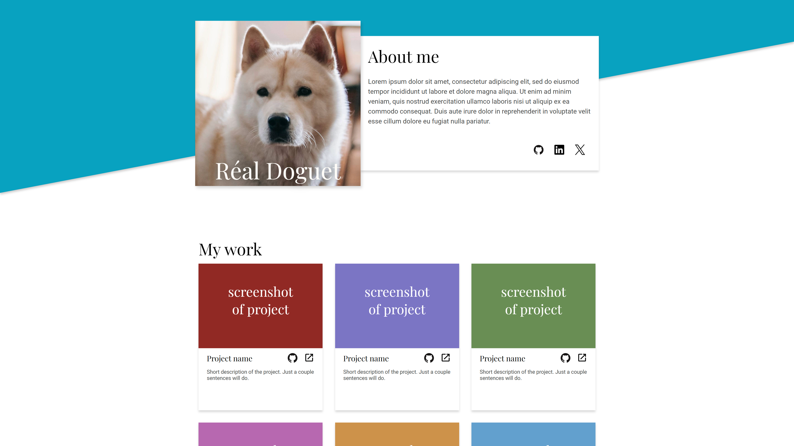
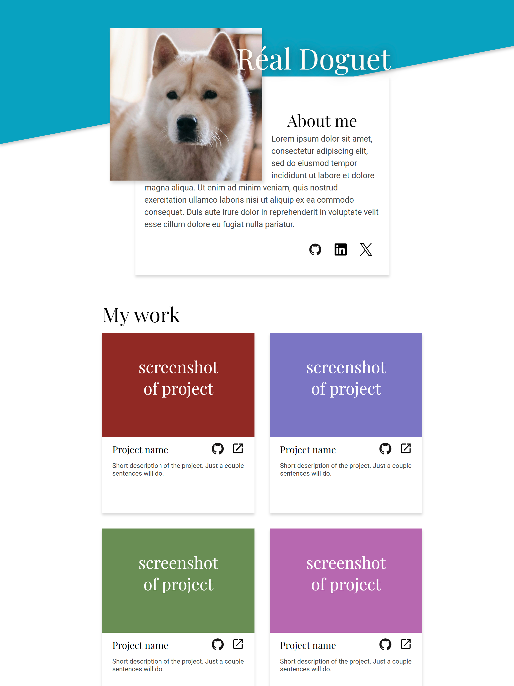
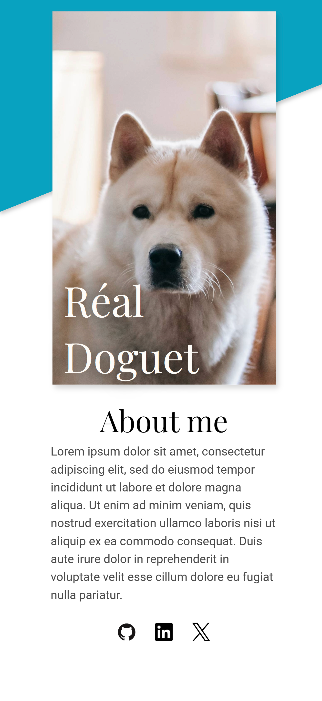

# Homepage

This is the project from [The Odin Project](https://www.theodinproject.com/lessons/advanced-html-and-css-homepage) curriculum — a responsive portfolio homepage built with **HTML and CSS**.

## Preview

### Desktop

### Tablet

### Mobile

## Features

- Responsive layout for desktop, tablet, and mobile
- CSS Grid and Flexbox layouts
- Responsive images and typography
- Simple hover animations and transitions
- Basic accessibility improvements
- Keyboard-friendly focus states

## Skills Learned

### HTML & CSS

- Semantic HTML
- CSS Grid
- CSS Flexbox
- Media queries
- Responsive design
- CSS positioning
- `object-fit` and `object-position`
- CSS transitions and hover effects

### Accessibility

- `aria-label` for icon-only links
- `aria-hidden` for decorative icons
- `alt` attributes for images
- `:focus-visible` for keyboard navigation

## Challenges

- Making the layout responsive across different screen sizes
- Adjusting the layout for desktop, tablet, and mobile
- Designing and adjusting the About Me section for different screen sizes
- Managing image positioning and text layout in the About Me section
- Managing images and content in responsive layouts
- Adding basic accessibility without making the HTML unnecessarily complex
